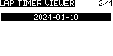

# Radiomaster MT-12 LapTimer

This script provides a robust lap timing function for the transmitter. It is possible to save and review the captuered lap times

Installation
------------
YOU DO NOT NEED ALL THE FILES ABOVE, ONLY THE ONES LISTED BELOW

1. Copy `SCRIPTS/TELEMETRY/LapTim.lua` to your SD card's `SCRIPTS/TELEMETRY` folder. Create the folder if it does not exist.
2. Copy the folder `SCRIPTS/TOOLS/LapTimer` to your SD card's `/SCRIPTS/TOOLS` folder. Create the folder if it does not exist.
3. Copy the folder `SCRIPTS/TOOLS/Laptimer.lua` script to your SD card's `/SCRIPTS/TOOLS` folder. 
4. For any model you wish to enable the lap timer on, from the Telemetry setup screen, add a new screen, choose *Script* as the Type, and `LapTim.lua` for the script name.

Timer Usage
-----------

To access the lap timer, press the "*TELE*" button. This will then display any Telemetry screens you have defined. If you have multiple screens, press the *PAGE>* button until you are on the lap timer screen.

This screen displays the current timer, lap and lap times. Lap times will roll of the screen as it runs out of space but they are kept in memory which can be saved later.

The timer will start when the "*Timer Switch*" is triggered. The lap is recorded when the "*Lap Switch*" is triggered.

When you are finished with your run un-triggrt the "*Timer Switch*". This will put you in "*Pause*" mode. From here you can re-trigger the "*Timer Switch*" and resume taking laps.

While "*Paused*" you can trigger the "*Lap Switch*". This will present a screen showing the "*Total Laps*", "*Average Lap*", and "*Total Time*". Here you can select to "*Save*" or "*Discard*" the lap times that were captured. Selecting either option will then reset the timer and you are ready for the next recording.

The lap times are saved to a file in the `/SCRIPTS/TOOLS/LapTimer/DATA` folder.

Tool Usage
----------

Under the SYS button, and in the TOOLS menu you should find "*LapTimer*". This menu allows acces to the lap viewer and setup modules. Any files saved from the LapTimer telemetry page will be viewable from the View Laps module. 

Setup Usage
-----------

You can use the Setup module to configure the Lap Timer.

In the Setup page you can configure;

* **Timer Switch** - This is the switch that arms and diarms the timer. This can be a Physical or Logical switch. Since most of the buttons on this controller is momentary it is better to use a logical switch for arming. Setup "*L01*" as "*STKY*" and assign both "*V1*" and "*V2" to a button down and select "*L01*" here. "*STKY*" with down and down make it a toggle.

* **Lap Switch** - This is the Switch you use to indicate a lap was just completed. This can be a Physical or Logical switch, It is best for this to be a momentary 2 position switch. 

* **Beep on Lap** - If *Yes*, when the *Lap Switch* is triggered a beep will be played.

* **Say Lap Number** - If *Yes*, when the "*Lap Switch*" is triggered and a lap can be computed. the lap number will be spoken.

* **Say Lap Time** - If *Yes*, when the "*Lap Switch*" is triggered and a lap can be computed. the lap time will be spoken.

* **Say Announcments** - If *Yes*, the state of the lap timer will be spoken depending on the "*Timer Switch*" and the "*Lap Switch*".

* **Speak Faster/Slower** - If *Yes* when the "*Lap Switch*" is triggered and a lap can be computed. your lap time will be compared and faster or slower will be spoken.

* **Count down timer - Sets the start timer in seconds. If it's zero then this function does nothing.

* **Number of laps - sets the number of laps before it announces race over. If it's zero then this function does nothing.

You can move from page to page using the "*PAGE<*" and "*PAGE>*" buttons to navigate the pages. Use the "*MENU WHEEL*" to select a field to change. Press the "*MENU WHEEL*" to lock to the value. Scroll the "*MENU WHEEL*" to changes the value. Press the "*MENU WHEEL*" to lock the value in and allow selection of the other values. When you use the "*RTN*" button changes are automatically saved. 

View Laps Usage
---------------

The "*View Laps*" module will display all the files located in the `/SCRIPTS/TOOLS/LapTimer/DATA` folder. It will present them by date. Use the "*MENU WHEEL*" to select a date, then press the "*MENU WHEEL*" to navigate to the next page which lists the times that the laps were taken. Use the "*MENU WHEEL*" to select a time, then press the "*MENU WHEEL*" to navigate to the next page which lists the lap times. Use the "*MENU WHEEL*" to scroll the screen if applicable. Use the "*RTN*" button to back out of the screen(s).

Special Actions
---------------

You can long press the "*RTN*" to back out of anything.

Release History
---------------

**Version 1.0.0 - Jan 9, 2024**: First release.
